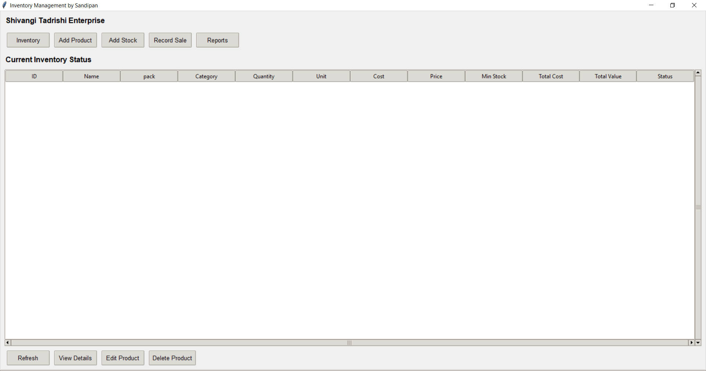
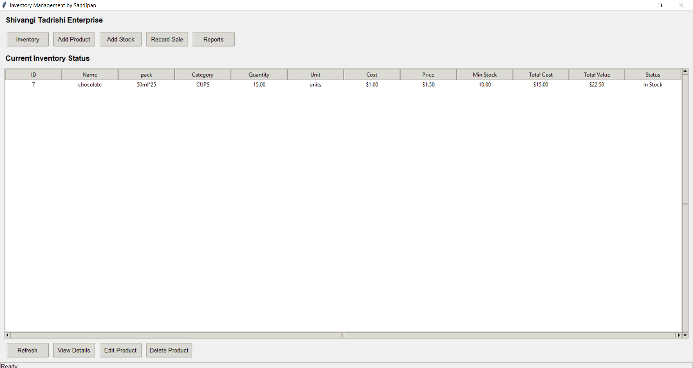
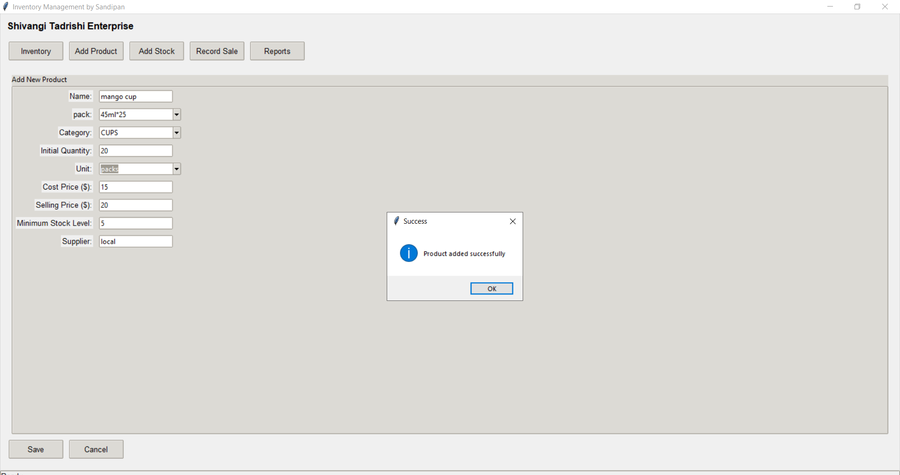
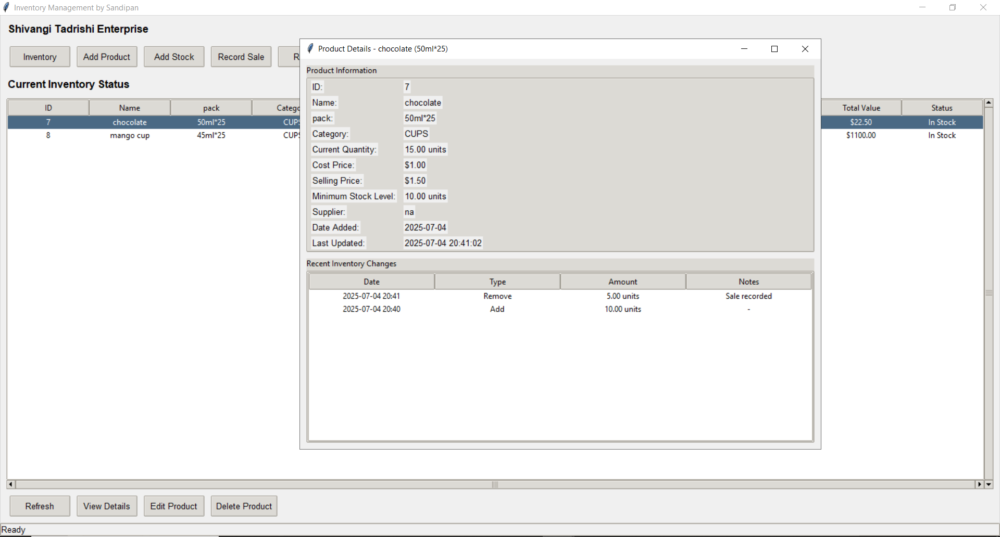
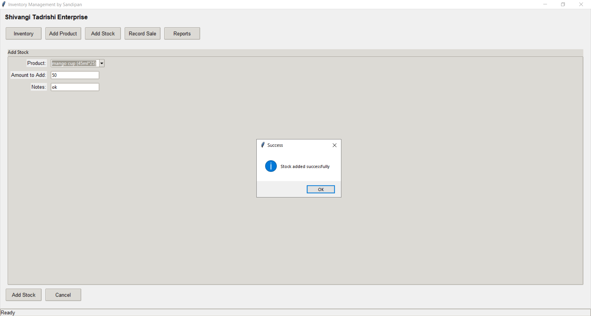
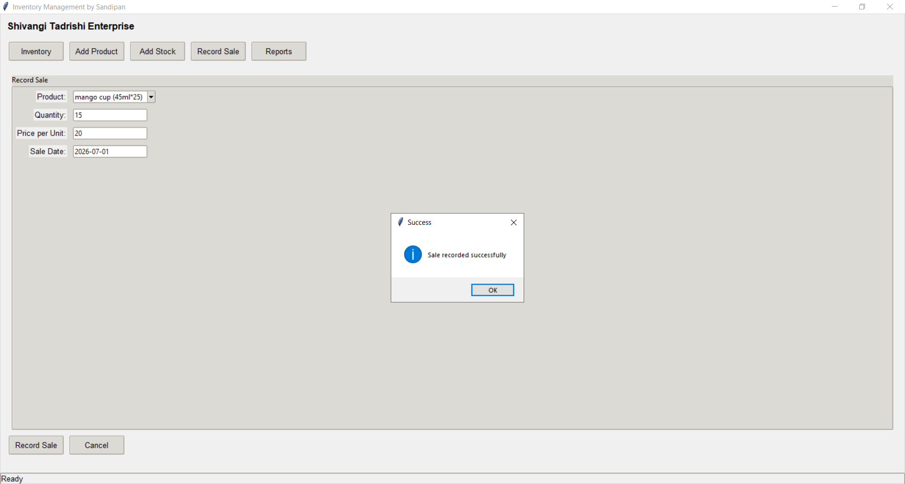
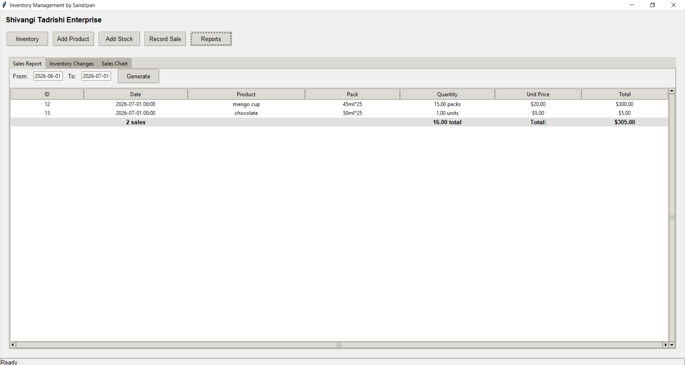
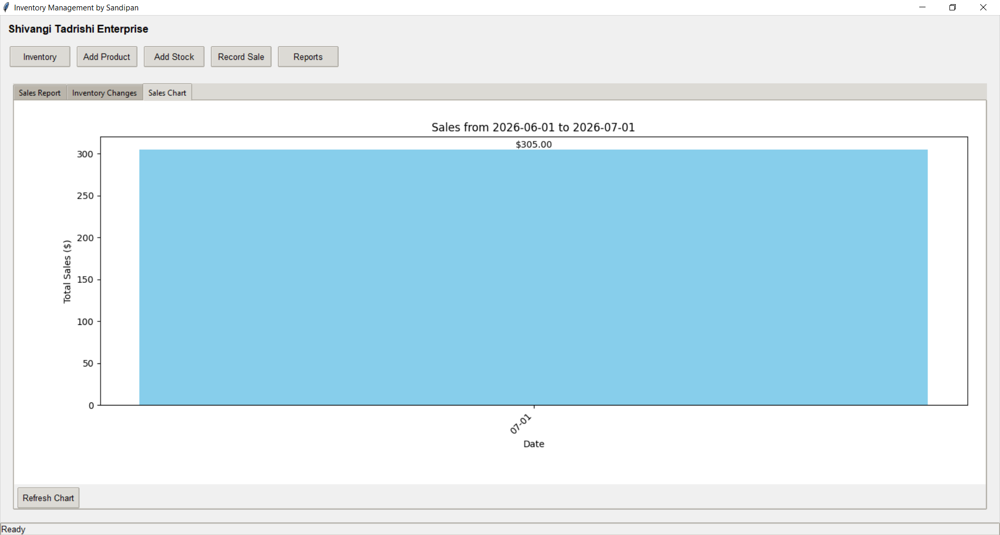

# 📦 Inventory Management System

<p align="center">

A desktop-based **Inventory Management System** developed using **Python**, **Tkinter**, and **MySQL** for managing products, inventory, sales, and business reports.

Designed as a real-world offline desktop application to demonstrate practical software development, database management, and GUI programming skills.

</p>

<p align="center">


</p>

---

# 📸 Project Preview


<p align="center">



</p>

---

# ✨ Features

| Feature                   | Description                                      |
| ------------------------- | ------------------------------------------------ |
| 📦 Product Management     | Add, edit, update and delete products            |
| 📊 Inventory Dashboard    | View complete inventory with stock value         |
| ➕ Add Stock               | Increase inventory with transaction logging      |
| ➖ Remove Stock            | Remove stock while maintaining history           |
| 💰 Sales Recording        | Record product sales with custom sale date       |
| 📉 Automatic Stock Update | Inventory updates automatically after every sale |
| ⚠ Low Stock Detection     | Highlights products below minimum stock level    |
| 📑 Sales Reports          | Generate date-wise sales reports                 |
| 📋 Inventory Logs         | Complete history of inventory movements          |
| 📈 Sales Charts           | Daily sales visualization using Matplotlib       |
| 🗄 MySQL Database         | Persistent storage using relational database     |

---

# 🛠 Tech Stack

| Technology      | Purpose                  |
| --------------- | ------------------------ |
| Python          | Application Logic        |
| Tkinter         | Desktop GUI              |
| MySQL           | Database                 |
| MySQL Connector | Database Connectivity    |
| Matplotlib      | Charts & Visualization   |
| ConfigParser    | Configuration Management |

---

# 🏗 Project Structure

```text
Inventory-Management-System/
│
├── main.py
├── db_connection.py
├── product_operations.py
├── inventory_operations.py
├── reports.py
├── schema.sql
├── README.md
├── requirements.txt
├── config.ini
│
├── screenshots/
│   ├── dashboard.png
│   ├── inventory.png
│   ├── product_details.png
│   ├── add_product.png
│   ├── add_stock.png
│   ├── record_sale.png
│   ├── reports.png
│   └── sales_chart.png
│
└── assets/
```

---

# ⚙️ Application Workflow

```text
                    +----------------+
                    |  Add Product   |
                    +-------+--------+
                            |
                            ▼
                  +-------------------+
                  |   MySQL Database  |
                  +---------+---------+
                            |
                            ▼
                  +-------------------+
                  | Inventory Dashboard|
                  +---------+---------+
                            |
        +-------------------+-------------------+
        |                                       |
        ▼                                       ▼
 +---------------+                     +----------------+
 |   Add Stock   |                     | Record Sale    |
 +-------+-------+                     +--------+-------+
         |                                       |
         +-------------------+-------------------+
                             |
                             ▼
                  +----------------------+
                  | Inventory Log Table  |
                  +----------+-----------+
                             |
                             ▼
                  +----------------------+
                  | Reports & Analytics  |
                  +----------------------+
```

---

# 📷 Screenshots

## 🏠 Dashboard


---

## 📦 Inventory Dashboard



---

## ➕ Add Product



---

## 📄 Product Details



---

## 📥 Add Stock



---

## 💰 Record Sale



---

## 📊 Reports



---

## 📈 Sales Chart



---

# 🗄 Database

The application uses a **MySQL relational database** consisting of:

* Products
* Sales
* Inventory Log

The database schema is provided in:

```text
schema.sql
```

---

# 🚀 Installation

## Clone the repository

```bash
git clone https://github.com/sandipan2598/Inventory-Management-System.git
```

## Open the project

```bash
cd Inventory-Management-System
```

## Install dependencies

```bash
pip install -r requirements.txt
```

## Create the database

```sql
SOURCE schema.sql;
```

## Configure database credentials

Update:

```text
config.ini
```

with your MySQL username, password and database name.

## Run the application

```bash
python main.py
```

---

# 🎯 Application Flow

1. Add Products
2. View Inventory
3. Add Stock
4. Record Sales
5. Inventory Automatically Updates
6. Low Stock Detection
7. Generate Reports
8. View Sales Chart

---

# 🚀 Project Highlights

* ✅ Desktop-based Inventory Management System
* ✅ Fully Offline Application
* ✅ Modular Python Architecture
* ✅ MySQL Database Integration
* ✅ CRUD Operations
* ✅ Inventory Tracking
* ✅ Sales Management
* ✅ Inventory Logs
* ✅ Interactive Reports
* ✅ Data Visualization using Matplotlib
* ✅ Real-world Business Workflow

---

# 📌 Future Enhancements

* 🔐 User Authentication
* 📄 Export Reports to Excel
* 📄 Export Reports to PDF
* 📷 Barcode Scanner Support
* ☁ Cloud Database Integration
* 👥 Multi-user Access
* 📱 Mobile Companion Application
* 🔔 Email Notifications for Low Stock

---

# 👨‍💻 Author

**Sandipan Dey**

---

<p align="center">

⭐ If you found this project useful, consider giving it a **Star** on GitHub.

</p>
